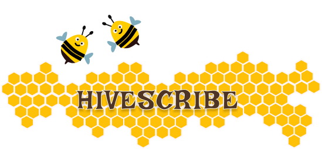

# 🐝 HIVESCRIBE
A 2D single player game. Play, Learn, Earn and Evolve.

**HIVESCRIBE** is a replayable 2D single-player game where players evolve through the **bee lifecycle**. 
— Grow from Larva to Honey — by completing blockchain-themed micro-tasks. 
-Players earn **Nectar (XP)** stored on-chain using the **Honeycomb Protocol**.
-Unlocking new tasks, traits as you grow until the final mintable **Honey Scroll NFT**.

---

## 🚀 **Features**

- ✅ 50 randomized tasks (text & multiple-choice)
- ✅ Earn Nectar (XP) to evolve: Larva → Pupa → Worker Bee → Hive → Honey
- ✅ Daily nectar forage streak (Verxio) for bonus XP
- ✅ Hive Board leaderboard ranks top players
- ✅ Mint final **Honey Scroll NFT** (0.01 SOL, Solana Pay)
- ✅ Mobile-friendly React UI with a hive progression ladder
- ✅ Phantom Wallet authentication

---

## 🧩 **Tech Stack**

- **Honeycomb Protocol** — Missions, Traits, Progression
- **Anchor** — Smart contracts for Nectar XP & NFT minting
- **Solana Pay** — NFT mint transactions
- **Verxio** — Daily streak rewards
- **React + Three.js** — Frontend UI & progression ladder
- **Vercel** — Hosting & deployment
- **Phantom Wallet** — Secure player login

---

## 🐝 **How to Start Play**

1. **Connect Wallet** — Players sign in with Phantom Wallet on Solana Devnet.
2. **Complete Tasks** — 50 randomized micro-tasks: text inputs & multiple choice.
3. **Earn Nectar** — Gain XP for each correct answer.
4. **Evolve** — Reach new lifecycle stages:
   - **Larva**: Start
   - **Pupa**: 500 XP (coding tasks unlocked)
   - **Worker Bee**: 1,500 XP (1.5× XP multiplier)
   - **Hive**: 3,000 XP (Hive Board unlocked)
   - **Honey**: 5,000 XP (mint NFT)
5. **Daily Streak** — Login daily for +50 XP with Verxio.
6. **Mint Honey Scroll** — Final NFT minted for 0.01 SOL using Solana Pay.
7. **Compete** — Check your rank on the Hive Board leaderboard.

---

## 📂 **Project Structure**
**COOKING😊**

